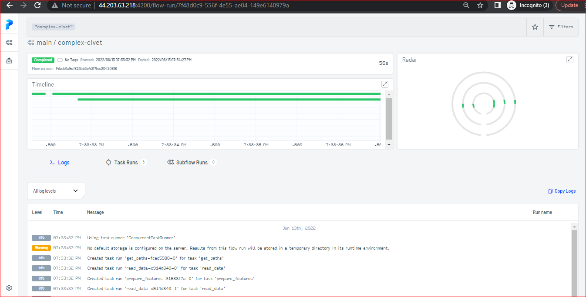

# Homework 3 Orchestration - Learnings - Akshit Miglani

[Homework link](https://github.com/DataTalksClub/mlops-zoomcamp/blob/main/03-orchestration/homework.md)

Setting up Markdowns on VS CODE: [Link](https://code.visualstudio.com/docs/languages/markdown)

# Q1: Converting Script to Prefect Flow

SSH onto Linux AWS EC2 Machine

+ Made a conda new environment

    conda -n env-prefect python=3.8.5
+ pip install -r requirements.txt to this environment
  1. sudo apt-get update
  2. sudo apt install python3-pip
  3. pip install requirements.txt
  
  `sudo` just gives elevated permissions . Our current profile does not have permissions to install stuff. `apt-get` is just the way to install libraries for ubuntu (non-Python)

+ Imported task and flow from prefect and added it to the code as decorators to functions

After adding all of the decorators, there is actually one task that you will need to call .result() for inside the flow to get it to work. Which task is this?

## Answer

lr, dv = train_model(df_train_processed, categorical).result()

## Problems

+ What if it says "conda not recognized" in VSCODE Terminal

  Activate code environment in ananconda prompt and then type "code" there and it will open the VSCODE

+ What if the OUTPUT tab shows nothing and code keeps on running in Terminal
  
  Install CodeRunner and press CTRL ALT N to run the code

# Q2: Parameterizing the flow 

The flow will take in a parameter called date which will be a datetime. date default is None b. If date is None, use the current day. If a date value is supplied, get 2 months before the date as the training data, and the previous month as validation data. As a concrete example, if the date passed is "2021-03-15", the training data should be "fhv_tripdata_2021-01.parquet" and the validation file will be "fhv_trip_data_2021-02.parquet". Then run for main(date="2021-08-15") and tell the validation MSE

## Answer

Get 1 & 2 months month back dates from the supplied date, then change it to the input file format (yyyy_mm) using `strftime`

+ String to datetime object = `strptime`
+ datetime object to other formats = `strftime`

```py
@task
def get_paths(date):
    prev_date = datetime.strptime(date, "%Y-%m-%d") - pd.DateOffset(months=1)
    twomonthback_date = datetime.strptime(date, "%Y-%m-%d") - pd.DateOffset(months=2)
    prev_yyyy_mm = datetime.strftime(prev_date, '%Y-%m')
    twomonthback_yyyy_mm = datetime.strftime(twomonthback_date, '%Y-%m')

    train_path = f'./data/fhv_tripdata_{twomonthback_yyyy_mm}.parquet'
    val_path = f'./data/fhv_tripdata_{prev_yyyy_mm}.parquet'
    return train_path, val_path
```

The MSE of validation for main(date="2021-08-15") is: 11.63703264088319

# Q3: Save model and dv pickle and tell the file size of dv when date is 2021-08-15

## Answer:

```
with open(model_name, "wb") as f_out:
      pickle.dump(lr, f_out)
```

#### https://stackoverflow.com/questions/11720079/linux-command-to-get-size-of-files-and-directories-present-in-a-particular-folde

```
ls -lh
-rw-rw-r-- 1 ubuntu ubuntu  13K Jun 10 19:54 dv-2021-08-15.pkl
```

Ans: 13K

# Q4: What is the Cron expression to run a flow at 9 AM every 15th of the month?

#### https://bradymholt.github.io/cron-expression-descriptor/

`0 9 15 * *` : At 09:00 AM, on day 15 of the month

```
DeploymentSpec(
    name="scheduled-deployment",
    flow_location="homework.py",
    schedule=CronSchedule(cron="0 9 15 * *"),
    flow_runner = SubprocessFlowRunner()
)
```

# Q5: Viewing Deployment: Number of upcoming scheduled runs on the top right of the dashboard

In the last step, I set up a deployment to run the workflow for 15th days of every month at 9:00 AM. In this question, I need to explore the UI and see how many runs are scheduled.

I am getting 4 scheduled flows and the closest answer is 3.


One workflow details:
In the timeline chart, it shows which task is running when. If we choose sequential runner, it won't overlap.

In the radar chart, it shows all the tasks we decorated.



# Q6: What is the command to view the available work-queues?
prefect work-queue preview

`prefect work-queue preview -h 10000 <work-queue-ID>`

TO DO:
- Cron 
- Decorators
- Docker
- Documentation/Flow of W3